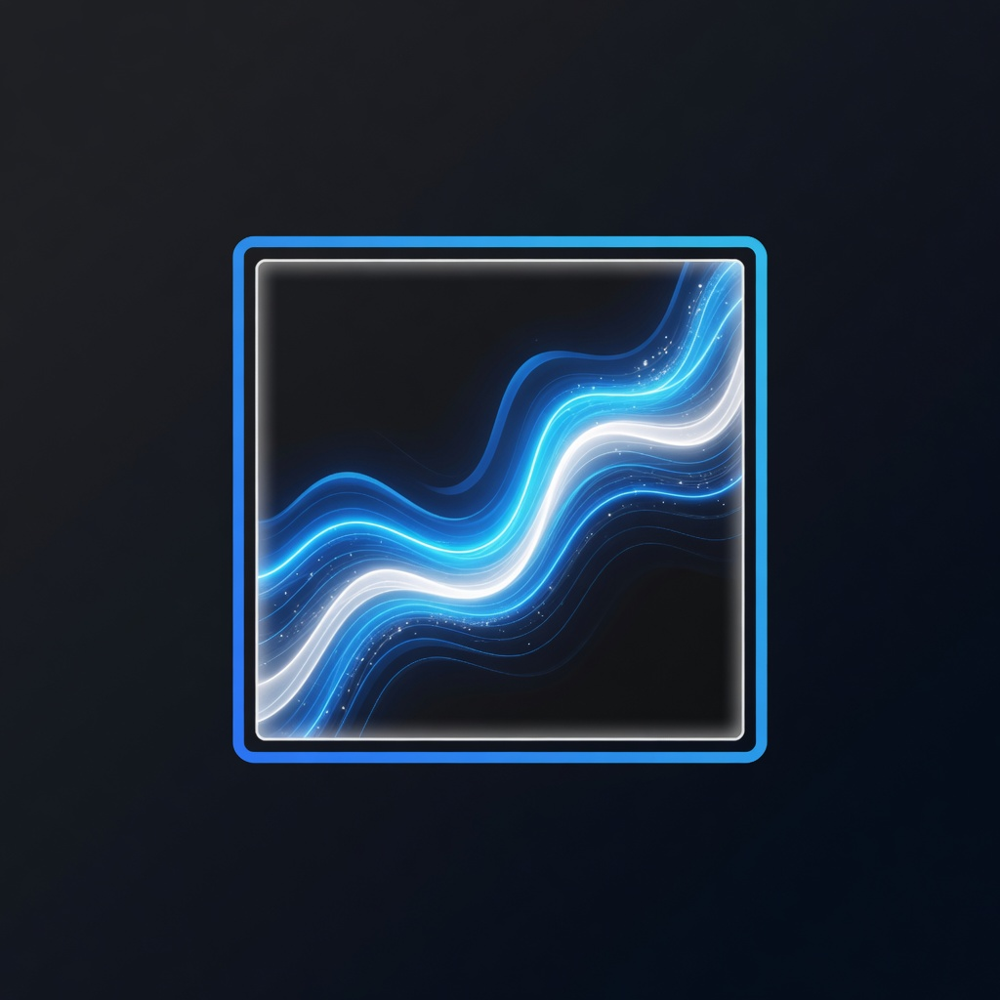

# Version Tag Test Validation Report

This report documents the local integration and visual verification tests performed for the initial `grok-image-mcp` release.

## Version: `v0.2.0-beta.1` (dev)
- **Build Date**: 2026-06-08
- **Platform**: macOS arm64 (`darwin/arm64`)
- **Go Version**: `go1.22+`
- **Conversion Source**: [nano-banana-mcpv2](https://github.com/notfixingit3/nano-banana-mcpv2)

---

## Conversion Checklist

| nano-banana-mcpv2 | grok-image-mcp | Status |
|---|---|---|
| `GEMINI_API_KEY` | `XAI_API_KEY` | ✅ Converted |
| `configure_gemini_token` | `configure_xai_token` | ✅ Converted |
| `generate_image` (Gemini) | `generate_image` (xAI `/images/generations`) | ✅ Converted |
| `generate_imagen` (Imagen 4) | Removed (xAI-only) | ✅ Intentionally removed |
| `edit_image` | `edit_image` (xAI `/images/edits`) | ✅ Converted |
| `continue_editing` | `continue_editing` | ✅ Converted |
| `get_last_image_info` | `get_last_image_info` | ✅ Converted |
| `get_configuration_status` | `get_configuration_status` | ✅ Converted |
| `~/.nano-banana-config.json` | `~/.grok-image-config.json` | ✅ Converted |
| `NANO_BANANA_LOG_FILE` | `GROK_IMAGE_LOG_FILE` | ✅ Converted |
| `GEMINI_IMAGE_MODEL` | `GROK_IMAGE_MODEL` | ✅ Converted |

---

## Protocol Tests (No API Credits Required)

Run with:

```bash
./scripts/test_protocol.sh
```

**Result: PASSED**

Run with:

```bash
go test -v ./...
./scripts/test_protocol.sh
```

Verified:
- MCP `initialize` returns `grok-image-mcp` v0.2.0-beta.1
- `tools/list` exposes all 6 expected tools
- `get_configuration_status` works with and without `XAI_API_KEY`
- `get_last_image_info` works without an API key in an empty session
- `continue_editing` returns a clear guard error when no prior image exists
- Legacy Gemini tool `generate_imagen` is correctly rejected as unknown
- `edit_image` rejects unsupported formats and files over 20 MiB before calling xAI
- `GROK_IMAGES_DIR` is accepted by the server
- Mock mode works without `XAI_API_KEY` (`get_configuration_status`, `generate_image`, `configure_xai_token`)
- Empty prompts and invalid `aspectRatio` values are rejected before API calls
- `--version` reports `0.2.0-beta.1`

## Unit Tests

**Result: PASSED** (13 tests)

Covers error formatting, model resolution, image validation, reference image warnings, API key validation (mocked), 429 retry behavior, and tool argument validation.

---

## Visual Assets (Grok Imagine)

Logo and sample output were generated with Grok Imagine and saved to `assets/`:

- **Logo**: [assets/logo.png](assets/logo.png)
- **Sample Output**: [assets/sample_output.png](assets/sample_output.png)

<p align="center">
  
</p>

<p align="center">
  
</p>

---

## Mock Integration Tests (No API Key Required)

Run with:

```bash
export GROK_IMAGE_MOCK=1
./scripts/test_mock.sh
```

**Result: PASSED**

Verified full offline flow:
- `generate_image` saves real files using `assets/sample_output.png`
- `continue_editing` works in a persistent server session (same as real MCP clients)
- `edit_image` and `get_last_image_info` work without xAI credits

---

## Live xAI API Integration Test

Run with OAuth (SuperGrok / X Premium+):

```bash
grok login   # once
unset XAI_API_KEY
./scripts/test_all.sh
```

Or with API key:

```bash
export XAI_API_KEY="your-key-here"
./scripts/test_all.sh
```

**Result: PASSED via Grok subscription OAuth** (generate, edit, continue_editing — no API key)

Previous API-key-only attempt was **BLOCKED — xAI account has no credits/licenses**

The configured xAI API key authenticates successfully for `get_configuration_status`, but image generation requests return HTTP 403:

```json
{
  "code": "The caller does not have permission to execute the specified operation",
  "error": "Your newly created team doesn't have any credits or licenses yet."
}
```

The server now surfaces this with a clearer message pointing to https://console.x.ai.

### Required to complete live API testing
1. Add credits or licenses to the xAI team at [console.x.ai](https://console.x.ai)
2. Re-run `./scripts/test_all.sh`
3. Optionally re-run `./scripts/generate_assets.sh` to dogfood assets through the MCP server itself

---

## Overall Status

| Area | Status |
|---|---|
| Go conversion from nano-banana-mcpv2 | ✅ Complete |
| Documentation updated | ✅ Complete |
| Grok-generated logo & sample assets | ✅ Complete |
| MCP protocol / stdio tests | ✅ Passed |
| Go unit tests | ✅ Passed |
| CI workflow (test + gosec) | ✅ Passing (0 issues) |
| Mock integration tests | ✅ Passed |
| Live xAI image generation/editing | ⏳ Blocked (no API credits) |